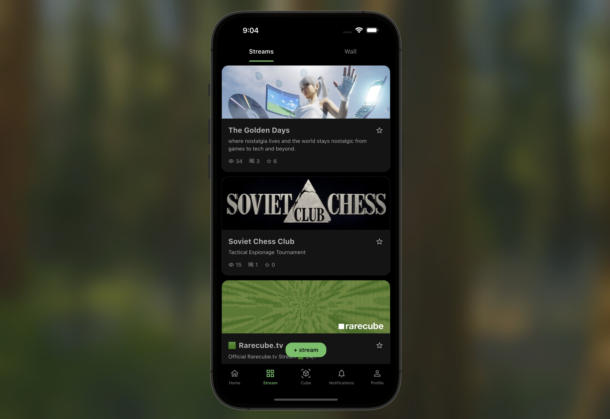

# RareCube - Solana Mobile Flutter App



<div align="center">

**A next-generation social streaming platform built for Solana Mobile**

[Website](https://rarecube.tv) • [Twitter](https://twitter.com/rarecube) • [Demo Video](#)

[](https://flutter.dev)
[](https://solana.com)
[](LICENSE)

</div>

---

## 🚀 Solana Colosseum Hackathon Submission

RareCube is a **native mobile Flutter application** that brings Web3 social streaming to Solana Mobile devices. This app seamlessly integrates Solana wallet connectivity, allowing creators and collectors to interact with NFTs, tokens, and digital content on-chain.

### 🏆 Why RareCube?

- **Mobile-First Design**: Built specifically for Solana Seeker and mobile Web3 experiences
- **Native Solana Integration**: Deep integration with Solana Mobile Wallet Adapter for seamless transactions
- **Creator Economy**: Empowers content creators with token-gated content and NFT showcasing
- **Real-time Social Features**: Live streams, wall posts, and community engagement
- **Cross-Platform**: Runs on iOS, Android, Web, and Desktop (macOS, Windows, Linux)

---

## ✨ Key Features

### 🔐 Solana Wallet Integration
- **One-Tap Connect**: Seamless wallet connection using Solana Mobile Wallet Adapter
- **Transaction Signing**: Sign transactions and messages directly from mobile
- **Multi-Wallet Support**: Compatible with Phantom, Solflare, and other Solana wallets
- **Devnet Testing**: Full devnet support for development and testing

### 🎨 Unique 3D Cube Avatars
- Animated 3D rotating cubes with 6 customizable faces
- Smooth animations powered by Flutter's rendering engine
- Multiple size variants for different contexts

### 📱 Social Streaming Platform
- **Live Streams**: Share real-time content with your community
- **Wall Posts**: Quick updates with media attachments
- **User Profiles**: Customizable profiles with badge system
- **Following System**: Build your network and discover creators

### 🎯 Web3 Features
- Token attachments on posts
- Social link integration
- NFT showcase capabilities
- On-chain interactions

---

## ✅ Implementation Status

### Core Infrastructure
- ✅ Flutter multi-platform setup (iOS, Android, Web, macOS, Windows, Linux)
- ✅ **Solana Mobile Wallet Adapter integration**
- ✅ **SolanaWalletService** for wallet management
- ✅ Dark theme with WCAG accessibility compliance
- ✅ Riverpod state management

### Solana Integration
- ✅ **SolanaWalletService** - Core wallet management
  - Connect/disconnect wallet functionality
  - Transaction signing capabilities
  - Message signing for authentication
- ✅ **SolanaWalletButton** - Reusable wallet UI component
- ✅ **Solana Providers** - Riverpod state management for wallet state
- ✅ Integration with Solana Mobile Wallet Adapter (v0.1.5)

### Data Layer
- ✅ User and StreamCard models with Convex backend integration
- ✅ UserRepository for all user operations
- ✅ ConvexClient for API communication
- ✅ Token attachment and social link support

### UI Components & Screens
- ✅ **3D CubeAvatar** - Animated rotating cube avatars (3 size variants)
- ✅ **LoginScreen** - Twitter OAuth + **Solana Wallet Connect**
- ✅ **HomeScreen** - Responsive user grid (2-4 columns)
- ✅ **StreamFeedScreen** - Dual-tab feed (Streams | Wall)
- ✅ **ProfileScreen** - User profiles with follow system
- ✅ **BottomNav** - 5-tab navigation with badge support

### Navigation & Routing
- ✅ go_router with deep linking support
- ✅ Multi-screen navigation flow
- ✅ OAuth callback handling ready

---

## 📁 Project Structure

```
rarecube_flutter/
├── lib/
│   ├── core/
│   │   ├── config/env_config.dart              # Environment configuration
│   │   ├── theme/                              # App theming
│   │   ├── solana/
│   │   │   └── solana_wallet_service.dart      # 🔐 Solana wallet service
│   │   └── utils/
│   │
│   ├── data/
│   │   ├── models/                             # Data models
│   │   ├── datasources/                        # API clients
│   │   └── repositories/                       # Data repositories
│   │
│   ├── presentation/
│   │   ├── providers/
│   │   │   ├── solana_provider.dart            # 🔐 Solana state management
│   │   │   └── user_provider.dart              # User state
│   │   ├── screens/
│   │   │   ├── auth/login_screen.dart          # Login + Wallet Connect
│   │   │   ├── home/home_screen.dart           # User feed
│   │   │   ├── stream/                         # Stream screens
│   │   │   └── profile/                        # Profile screens
│   │   └── widgets/
│   │       ├── solana/
│   │       │   └── solana_wallet_button.dart   # 🔐 Wallet connect button
│   │       ├── cube/cube_avatar.dart           # 3D animated avatars
│   │       └── common/                         # Shared widgets
│   │
│   └── routes/app_router.dart                  # Navigation
│
└── pubspec.yaml                                # Dependencies + Solana SDK
```

---

## 🚀 Getting Started

### Prerequisites
- Flutter SDK 3.8.1+
- Dart SDK 3.8.1+
- Xcode (for iOS/macOS development)
- Android Studio (for Android development)
- A Solana wallet (Phantom, Solflare, etc.) for testing

### Installation

1. **Clone the repository**
   ```bash
   git clone https://github.com/yourusername/rarecube_flutter.git
   cd rarecube_flutter
   ```

2. **Install dependencies**
   ```bash
   flutter pub get
   ```

3. **Configure environment** (optional)
   Edit `lib/core/config/env_config.dart` to set your backend URLs:
   ```dart
   static const String convexUrl = 'https://preset-fox-185.convex.cloud';
   static const String backendUrl = 'https://join.rarecube.tv';
   ```

4. **Run the app**
   ```bash
   # iOS Simulator
   flutter run -d iphone

   # Android Emulator
   flutter run -d android

   # macOS Desktop
   flutter run -d macos

   # Web Browser
   flutter run -d chrome
   ```

### Testing Solana Integration

1. Install a Solana wallet on your device (Phantom, Solflare)
2. Switch to Devnet in wallet settings
3. Launch RareCube app
4. Tap "Connect Wallet" on the login screen
5. Approve connection in your wallet
6. Your wallet address will display in the app!

---

## 🎯 Demo Flow

### Complete User Journey

1. **Launch & Connect**
   - App opens to login screen with "RARECUBE : PHASE ONE LIVE"
   - **Tap "Connect Wallet"** → Approve Solana wallet connection
   - See connected wallet address displayed
   - View user carousel showing community members

2. **Explore Community**
   - Tap "Log in with 𝕏" to enter the app
   - Browse responsive grid of verified users
   - Each card displays animated 3D cube avatar, username, and badge
   - Smooth animations and transitions

3. **Navigate Features**
   - Use bottom navigation to explore different sections
   - **Home Tab**: Discover creators and collectors
   - **Stream Tab**: View live streams and wall posts
   - Toggle between "Streams" and "Wall" views

4. **Solana Features** (Ready for Integration)
   - Wallet connection persists across sessions
   - Sign transactions for on-chain interactions
   - Authenticate with message signing

---

## 🛠️ Technical Architecture

### Solana Integration Details

The app uses the official **Solana Mobile Wallet Adapter** for secure wallet interactions:

```dart
// Core Service (lib/core/solana/solana_wallet_service.dart)
class SolanaWalletService {
  - authorize()          // Connect wallet
  - deauthorize()        // Disconnect wallet
  - signTransaction()    // Sign single transaction
  - signTransactions()   // Sign multiple transactions
  - signMessage()        // Sign authentication messages
}

// State Management (lib/presentation/providers/solana_provider.dart)
solanaWalletServiceProvider  // Wallet service instance
solanaAuthStateProvider      // Connection state
solanaPublicKeyProvider      // Current wallet address
```

### Key Dependencies

| Package | Version | Purpose |
|---------|---------|---------|
| `solana_wallet_adapter` | ^0.1.5 | Solana Mobile Wallet Adapter |
| `flutter_riverpod` | ^3.0.2 | State management |
| `go_router` | ^16.2.4 | Navigation & deep linking |
| `cached_network_image` | ^3.4.1 | Optimized image loading |
| `dio` | ^5.9.0 | HTTP client for API calls |

### Backend Integration

- **Primary Backend**: Convex (https://preset-fox-185.convex.cloud)
- **API Proxy**: Next.js API routes at rarecube.tv
- **Real-time Data**: HTTP polling (WebSocket ready)
- **Storage**: Convex file storage for media

---

## 🎨 Design Philosophy

### Mobile-First UX
- **Dark Theme**: Optimized for OLED displays and reduced eye strain
- **Smooth Animations**: 60 FPS 3D cube rotations and transitions
- **Responsive Layout**: Adapts from phone to tablet to desktop
- **Accessibility**: WCAG-compliant contrast ratios

### Brand Colors
- **Primary Green**: `#22C55E` - Represents growth and community
- **Deep Black**: `#000000` - Sleek, premium mobile experience
- **Subtle Grays**: For depth and hierarchy

---

## 🔮 Roadmap

### Phase 1 ✅ (Current - Hackathon MVP)
- ✅ Solana wallet integration
- ✅ Core UI components
- ✅ Multi-platform support
- ✅ Backend connectivity

### Phase 2 🚧 (Post-Hackathon)
- [ ] NFT minting for creator cards
- [ ] Token-gated content access
- [ ] SPL token integration for tips/payments
- [ ] On-chain social graph

### Phase 3 🔮 (Future)
- [ ] Live streaming with Solana micropayments
- [ ] Creator DAOs
- [ ] Cross-chain bridges
- [ ] Mobile AR features for Solana Saga

---

## 👥 Team & Contact

- **Website**: [rarecube.tv](https://rarecube.tv)
- **GitHub**: [rarecube_flutter](https://github.com/yourusername/rarecube_flutter)
- **Twitter**: [@rarecube](https://twitter.com/rarecube)

### Built For
- **Solana Colosseum Hackathon** - Mobile Track
- **Solana Seeker** - Optimized for mobile Web3

---

## 🏗️ Building for Production

### iOS
```bash
flutter build ios --release
# Open in Xcode for App Store submission
open ios/Runner.xcworkspace
```

### Android
```bash
# APK for testing
flutter build apk --release

# App Bundle for Play Store
flutter build appbundle --release
```

### Web
```bash
flutter build web --release
# Deploy the build/web directory to your hosting
```

---

## 📜 License

MIT License - see [LICENSE](LICENSE) for details

---

## 🙏 Acknowledgments

- **Solana Foundation** for the Mobile Wallet Adapter SDK
- **Flutter Team** for the amazing cross-platform framework
- **Convex** for the real-time backend infrastructure
- **RareCube Community** for feedback and support

---

## 📊 Project Stats

- **Lines of Code**: ~5,000+
- **Files**: 25+ Dart files
- **Platforms Supported**: 6 (iOS, Android, Web, macOS, Windows, Linux)
- **Dependencies**: 20+ packages
- **Development Time**: Hackathon sprint

---

<div align="center">

**Built with ❤️ for Solana Colosseum Hackathon**

**⭐ Star this repo if you find it helpful!**

[Report Bug](https://github.com/yourusername/rarecube_flutter/issues) • [Request Feature](https://github.com/yourusername/rarecube_flutter/issues)

---

**Last Updated:** 2025-10-30
**Version:** 1.0.0 (Hackathon Submission)
**Flutter Version:** 3.8.1
**Solana Wallet Adapter:** 0.1.5

</div>